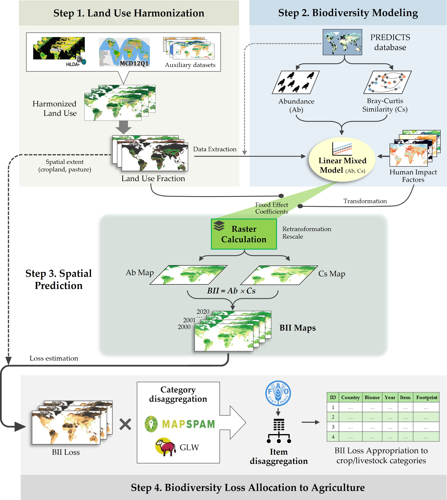
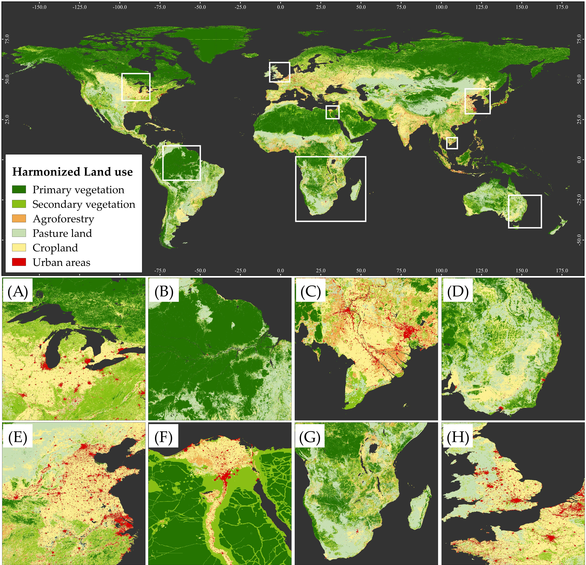
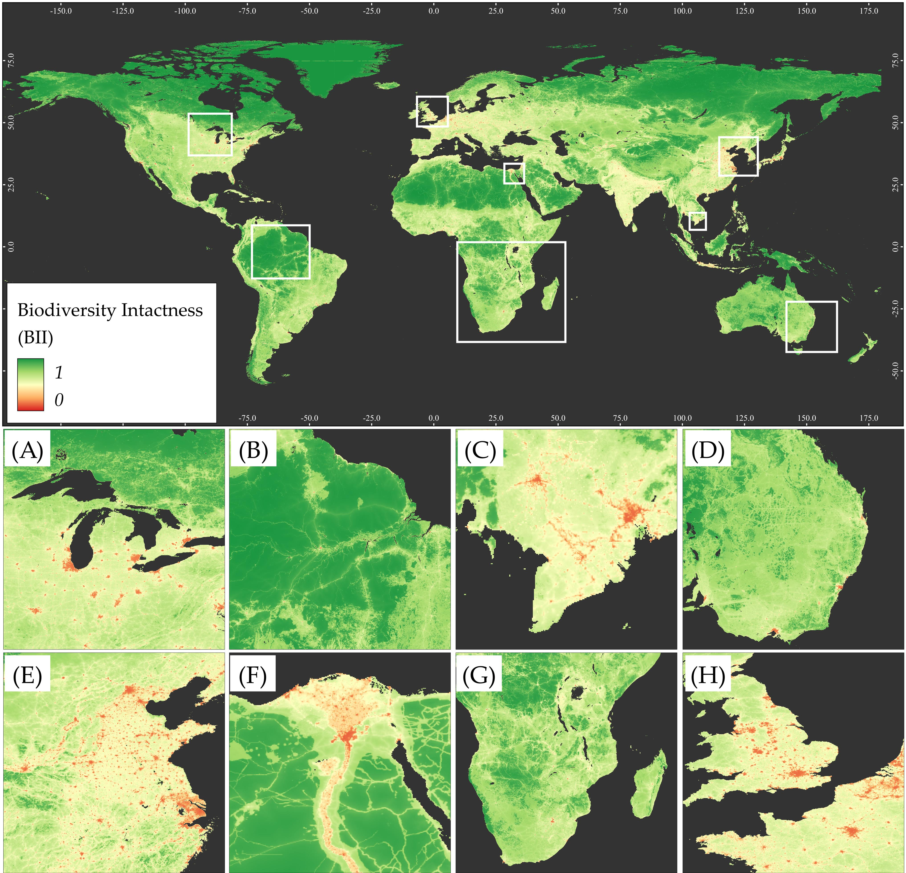
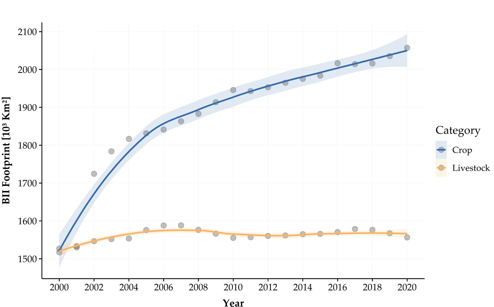

## **Consistent global datasets on Land Use, Biodiversity Intactness Index, and Biodiversity Intactness Footprint of Agricultural Production from 2000 to 2020**

 

This archive provides consistent global datasets on **Harmonized Land-use, Biodiversity Intactness Index (BII), and Biodiversity Intactness Footprint (BIIFP)** of Agricultural production from 2000 to 2020.

Global High-resolution Harmonized Land Use (HHLU) maps reflect land use and vegetation states in seven (07) categories: (1) Primary-minimal use vegetation, (2) Primary vegetation, (3) Secondary vegetation, (4) Cropland, (5) Urban lands, (6) Pasture/Grazing lands, (7) Agroforestry.

Land-use Fraction (LUF) maps present land-use proportions for each aggregated location for land use classes corresponding to HHLU (value range, 0-1). *Primary minimal-use vegetation and Primary vegetation are combined into Primary vegetation*.

Biodiversity Intactness Index (BII) maps simulate terrestrial biodiversity integrity across all land use categories, ranging from 0 to 1.

Biodiversity loss footprint (BII loss) tabular data allocates biodiversity loss footprints induced by agricultural production (crops and livestock), which estimates BII loss over 14 biomes, 193 countries and territories, 154 crops, and 09 livestock categories from 2000 to 2020.

 

### **Summary**

 

<b>Figure.</b> General flowchart to generate Harmonized Land Use, Biodiversity Intactness Index (BII), and Agricultural Footprints

 

 

<b>Figure.</b> Harmonized land use map in 2020 and fragmented zoom-in examples in (A) Northeast America, (B) Amazon, (C) Mekong Delta, (D) Eastern Australia, (E) Northeast China, (F) Nile Delta in Egypt, (G) Southern Africa, and (H) Western Europe, depict dominant land use categories globally

 

 

<b>Figure.</b> Biodiversity intactness index (BII) in 2020 and examples in (A) Northeast America, (B) Amazon, (C) Mekong Delta, (D) Eastern Australia, (E) Northeast China, (F) Nile Delta in Egypt, (G) Southern Africa, and (H) Western Europe. Green represents intact ecosystems and red indicates ecosystems with high human intervention

 

 

<b>Figure.</b> Overall trend of total BII footprint on crops and livestock from 2000 to 2020, and comparisons between average footprint. The footprint from the livestock sector has gradually declined, whereas the footprint associated with crop production has increased persistently over time

### **Data version notes**

* **Version 2** – Released in Augsust 2025
    * Adjusted the method for meat and dairy livestock disaggregation by removing [Our World in Data](https://ourworldindata.org/meat-production), now relying solely on [FAOSTAT](https://www.fao.org/faostat/en/#data/QCL) data.
 
* **Version 1** – Released in July 2025
    * Updated to include [GLW](https://www.fao.org/livestock-systems/global-distributions/en/) data in 2020 and [Global Pasture Watch data](https://www.nature.com/articles/s41597-024-04139-6).
    * Corrected allocation within the agroforestry sector.

* **Version 0.1** – Released in January 2025
    * The original data release.

### Cite our works

* Nguyen, C. T., Vačkářová, D., and Weinzettel, J. (2025). Consistent global dataset on biodiversity intactness footprint of agricultural production from 2000 to 2020. Scientific Data. <a href="https://doi.org/10.1038/s41597-025-05901-0">10.1038/s41597-025-05901-0</a>
* Nguyen, C. T., Vačkářová, D., and Weinzettel, J. (2025). Consistent global datasets on Land Use, Biodiversity Intactness Index, and Biodiversity Intactness Footprint of Agricultural Production from 2000 to 2020. figshare. Dataset. <a href="https://doi.org/10.6084/m9.figshare.28303442.v2">10.6084/m9.figshare.28303442.v2</a>

